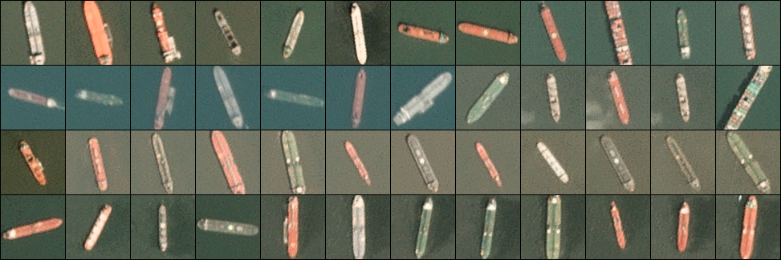
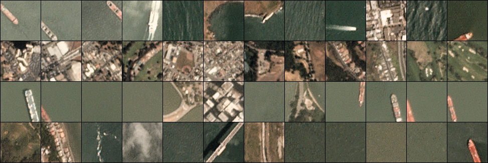

# Content

1. Dataset Information 
   1. Context 
   2. Content 
   3. Class Labels
   
2. Loading and Checking Dataset 
   1. Loading and Reshaping 
   2. Exploring the Images 

3. Modelling
   1. Preparing of Test and Train Data
   2. Implementation of Convolutional Neural Network (CNN)

In this notebook, I will create a model that predicts weather there is ship in the image or not.

# Dataset Information

## Context

Satellite imagery provides unique insights into various markets, including agriculture, defense and intelligence, 
energy, and finance. New commercial imagery providers, such as Planet, are using constellations of small satellites to 
capture images of the entire Earth every day. The aim of this dataset is to help address the difficult task of detecting
the location of large ships in satellite images. Automating this process can be applied to many issues including 
monitoring port activity levels and supply chain analysis.

## Content
The dataset consists of image chips extracted from Planet satellite imagery collected over the San Francisco Bay and 
San Pedro Bay areas of California. It includes 4000 80x80 RGB images labeled with either a "ship" or "no-ship" 
classification. Image chips were derived from PlanetScope full-frame visual scene products, which are zoomed-in to a 3 
meter pixel size.

The dataset is also distributed as a JSON formatted text file `shipsnet.json`. 
The loaded object contains data, label, scene_ids, and location lists.

1. **label**: Valued 1 or 0, representing the "ship" class and "no-ship" class, respectively.
2. **scene id**: The unique identifier of the PlanetScope visual scene the image chip was extracted from. The scene id can be used with the Planet API to discover and download the entire scene.
3. **longitude_latitude**: The longitude and latitude coordinates of the image center point, with values separated by a single underscore.

The pixel value data for each 80x80 RGB image is stored as a list of 19200 integers within the data list. The first 6400
entries contain the red channel values, the next 6400 the green, and the final 6400 the blue. The image is stored in 
row-major order, so that the first 80 entries of the array are the red channel values of the first row of the image.

## Class Labels
The "ship" class includes 1000 images. Images in this class are near-centered on the body of a single ship. 
Ships of different sizes, orientations, and atmospheric collection conditions are included. Example images from this 
class are shown below.

The "no-ship" class includes 3000 images. A third of these are a random sampling of different landcover features - water,
vegetation, bare earth, buildings, etc. - that do not include any portion of an ship. The next third are "partial ships"
that contain only a portion of an ship, but not enough to meet the full definition of the "ship" class. The last third 
are images that have previously been mislabeled by machine learning models, typically caused by bright pixels or strong 
linear features. Example images from this class are shown below.

Loading and modelling upon the data can be found inside the [notebook.](notebook.ipynb)

